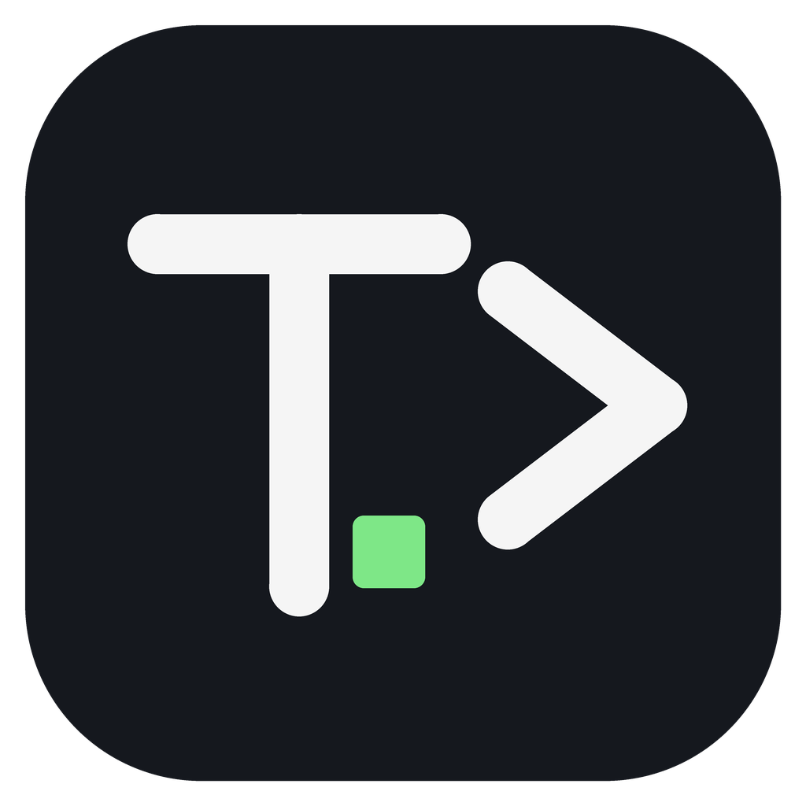

# Terminalauncher

A minimal command line Minecraft launcher, with a PCL-style content manager.  
EN | [DE](README_de.md)

[](https://github.com/qwertasd501/Terminalauncher/actions/workflows/build.yml)


> This repository is a modified fork of [telecter/cmd-launcher](https://github.com/telecter/cmd-launcher),
> which is MIT licensed. The original copyright notice is kept in [LICENSE](LICENSE), next to the one
> for the changes made here. See [License](#license) below.

- [Installation](#installation)
  - [Binaries](#binaries)
  - [Via go install](#via-go-install)
  - [Building from source](#building-from-source)
- [What this fork adds](#what-this-fork-adds)
- [Usage](#usage)
  - [Instances](#instances)
  - [Starting the game](#starting-the-game)
  - [Content manager](#content-manager)
  - [Settings](#settings)
  - [Authentication](#authentication)
  - [Instance Configuration](#instance-configuration)
  - [Search](#search)

[API Documentation](docs/API.md)

## Installation

### Binaries
You can download prebuilt binaries from the Releases tab here on GitHub.  
For Windows, `Terminalauncher-windows-amd64-portable.zip` is the portable package: unzip it
anywhere and run `Terminalauncher.exe`, nothing is installed and no `PATH` entries are created.  
Builds of the latest commit are available at [nightly.link](https://nightly.link/qwertasd501/Terminalauncher/workflows/build/main).

### Via go install

```sh
go install github.com/qwertasd501/Terminalauncher@latest
```

### Building from source

1. Clone the repository: `git clone https://github.com/qwertasd501/Terminalauncher`
2. In the source directory, run `go run .` to compile and run the launcher.
3. Once you are ready, compile the executable with `go build .`

## What this fork adds

- **Content manager** (PCL style): mods, resourcepacks, shaderpacks, datapacks and modpacks, with
  browsing and installation from Modrinth and a batch-update command. Reachable both globally and
  from a version's settings page.
- **Six languages**: English, German, Chinese, French, Russian and Spanish. Switch at runtime with
  `settings language <code>`; the system locale is used when nothing is configured.
- **Guided `download version` wizard**, which asks only for what is missing and names instances the
  way PCL does, e.g. `1.20.1-Forge_47.4.16-LTSC`.
- **Instances are complete the moment they are created** - libraries, assets and the Java runtime
  are fetched up front, so `start` does not stall on a first-run download.
- **Faster downloads**: concurrent transfers (`settings download_threads`, default 16) with retries
  on `429`/`5xx` and checksum mismatches.
- **`clear memory`**: trims the launcher's working set back to the page file.
- **Portable mode**: a `portable.txt` file (or `--portable`) next to the executable keeps all data
  in the launcher folder, so it can be copied to a USB stick.

## Usage

Use the `--help` flag to get the usage information of any command.

### Instances

**Creating an instance**  
To create a new instance, use the `inst create` command.  
You can use the `--loader, -l` flag to set the mod loader. Forge, NeoForge, Fabric, and Quilt are all supported. If you want to select a specific version of the loader, use the `--loader-version` flag. Otherwise, the latest applicable version is chosen.

Use the `--version, -v` flag to set the game version. If no value is supplied, the latest release is used. Acceptable values also include `release` or `snapshot` for the latest of either.

When starting the game, the launcher will attempt to download a Java runtime from Mojang. If it can't find a suitable one, you will need to set one manually in the instance configuration.

```sh
Terminalauncher inst create -v 1.21.8 -l fabric CoolInstance
```

A version is created under the standard directory, `<game directory>/versions/<name>`, where PCL and
the official launcher keep theirs, and its game data stays with it (version isolation is on, and can
be changed from the version's own settings). Versions an older build created in
`<game directory>/instances/<name>` are still found, started and deleted as usual.

**Deleting instances**  
If you want to delete an instance, use the `inst delete` command followed by the instance name.

### Starting the Game


To start Minecraft, simply run the `start` command followed by the name of the instance you want to start.

```bash
Terminalauncher start CoolInstance
```

To set game options and override instance configuration, you can set specific flags on the `start` command. These can be viewed in the help text.

**Verbosity**  
To increase the verbosity of the launcher, use the `--verbosity` flag. It can be set to either:

- `info` - default, no extra logging
- `extra` - more information when starting the game
- `debug` - debug information useful for debugging the launcher

### Content manager

Inside the shell, `mods`, `resourcepacks`, `shaderpacks`, `datapacks` and `modpacks` open a picker for
the current instance, where entries can be added from Modrinth, updated in batch or removed. The same
screens are reachable from `versions` -> a version -> content manager.

```bash
Terminalauncher mods          # content of the selected instance
Terminalauncher versions      # pick a version, then manage its content
```

### Settings

Launcher-wide options are stored next to the game directory and can be changed from the command line
or from the shell:

```bash
Terminalauncher settings                    # list current values
Terminalauncher settings language zh        # switch the interface language
Terminalauncher settings download_threads 32
```

### Authentication

If you want to play the game in online mode, you will need to add a Microsoft account.

To do this, use the `auth login` command. As part of Microsoft's OAuth2 flow, the default web browser will be opened to complete the authentication. This can be avoided with the `--no-browser` flag.  
The launcher will automatically attempt to start the game in online mode if there is an account present.

To play in offline mode, just pass the `-u, --username <username>` flag to the `start` command
to set your username and the game will automatically launch in offline mode.

You can log out via the `auth logout` command.

### Instance Configuration

To change configuration values for an instance, navigate to the instance directory and open the `instance.toml` file.

Configurable values are:

- Game version
- Mod loader and version (if not vanilla)
- Window resolution
- Java executable path (if empty, a Mojang-provided Java runtime will be downloaded)
- Custom JAR path to use instead of downloading the normal client JAR
- Extra Java args
- Minimum and maximum memory

As mentioned previously, these values can be overriden with command line flags.

**Example `instance.toml` file**

```toml
game_version = '1.21.8'
mod_loader = 'fabric'
mod_loader_version = '0.16.14'

[config]
# Path to a Java executable. If blank, a Mojang-provided JVM will be downloaded.
java = '/usr/bin/java'
# Extra arguments to pass to the JVM
java_args = ''
# Path to a custom JAR to use instead of the normal Minecraft client
custom_jar = ''
# Minimum game memory, in MB
min_memory = 512
# Maximum game memory, in MB
max_memory = 4096

# Game window resolution
[config.resolution]
width = 1708
height = 960

```

### Search

The `search` command can search for Minecraft or mod loader versions. It defaults to searching for game versions, but can also be used to search for Fabric, Quilt, and Forge versions.

```bash
Terminalauncher search [<query>] [--kind {versions, fabric, quilt, forge}]
```

## License

MIT. The full text is in [LICENSE](LICENSE).

The original `cmd-launcher` was written by [telecter](https://github.com/telecter/cmd-launcher), and
Terminalauncher is a fork of it. Both notices are kept in the license file:

- `Copyright (c) 2024-2025 telecter` covers the original program.
- `Copyright (c) 2026 qwertasd501` covers the changes made in this fork.

Redistributing a binary of this build therefore means shipping the `LICENSE` file with it, which is
what the portable package does.
